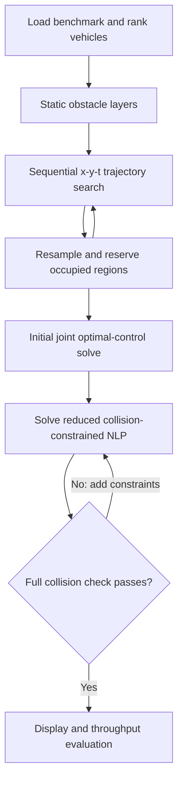

# AIM_COCP — Continuous-Space Intersection Management (IFAC 2020)

**Coordinate vehicle trajectories over continuous intersection space.** This MATLAB/AMPL repository implements the method in **“Autonomous Intersection Management over Continuous Space: A Microscopic and Precise Solution via Computational Optimal Control”**, by **Bai Li, Youmin Zhang, Ning Jia, and Xiaoyan Peng**, published in *IFAC-PapersOnLine*, **53**(2), **17071–17076**, 2020. [Read the source paper](https://doi.org/10.1016/j.ifacol.2020.12.1611).

The planner first creates ordered, collision-aware initial trajectories in an `(x, y, t)` graph. It then optimizes the vehicles jointly, progressively adding collision-avoidance constraints until the full candidate passes collision checking. The supplied benchmark driver handles **24 vehicles per case** and contains **50 cases**.

## How the pieces fit together



The implementation follows the method in Sections 2 and 3 of the source paper:

1. **Continuous-space optimal control (Section 2).** Jointly plan vehicle states and controls subject to kinematics, drivable regions, boundary conditions and inter-vehicle collision avoidance. The objective balances acceleration/steering-rate smoothness with progress along each vehicle's exit direction.
2. **Collision geometry (Sections 2.2–2.3).** Represent each rectangular vehicle by two covering discs and approximate street-block geometry by inscribed circles. Use the resulting circle-distance and drivable-region constraints in the optimization model.
3. **Priority-based initialization (Section 3.2).** Rank vehicles by expected intersection-exit time and search a coarse trajectory for each vehicle using **x-y-time A***. Previously planned vehicles are treated as moving obstacles while planning the remaining vehicles.
4. **Numerical solution (Sections 3.1 and 3.3).** Discretize the optimal-control problem with explicit first-order Runge–Kutta equations and solve the resulting NLP by an interior-point method. Initially omit vehicle-to-vehicle collision constraints, then add them incrementally and check the complete candidate until a feasible cooperative solution is obtained.

The paper presents this as an **offline AIM method**. The repository's MATLAB driver implements the search/optimization sequence through file exchange with AMPL and IPOPT.

## Run a benchmark

Requirements: **MATLAB on Windows**, compatible supplied **P-code**, and a working **AMPL/IPOPT** installation with a valid AMPL license. The scripts rely on Windows paths and relative file exchange; a MATLAB–AMPL API is not required.

```matlab
cd('C:/path/to/AIM_COCP');
RunMe;
```

**The unmodified driver runs all 50 cases.** For an initial single-case experiment, edit the loop near the top of `RunMe.m`:

```matlab
for case_id = 1               % Replace 1 : 50 with your chosen case, 1–50
```

Keep `Benchmarks/` and the solver/model files in place. Use a writable checkout because the driver writes and reloads optimization inputs, status flags and trajectories. It calls the protected `ProduceVideo.p` display/output helper after a successful solution and evaluates throughput. The driver also includes repeated-failure and elapsed-time stopping conditions; solver termination alone is not the full collision acceptance criterion.

## Function guide

| File | Role |
| --- | --- |
| `RunMe.m` | Case loop, physical parameters, search initialization, repeated NLP solves and acceptance logic. |
| `SpecifyRanklist.m` | Construct the order in which vehicle initial trajectories are planned. |
| `GenerateOriginalObstacleLayers.m` | Build the original obstacle representation over time. |
| `SearchTrajectoryInXYTGraph.m` | Search a single vehicle's warm-start trajectory in space and time. |
| `ResampleProfile.m` | Match a searched path/profile to the optimization discretization. |
| `UpdateObstacleLayers.m` | Reserve the occupied regions of previously planned vehicles. |
| `SpecifyInitialGuess.m` | Write state/control initial guesses for optimization. |
| `WriteBoundaryValuesAndBasicParams.p` | Protected writer for task and vehicle parameters. |
| `WriteObstaclesForReducedNLP.p` | Protected construction of collision constraints for a reduced problem. |
| `CheckCollisions.p` | Protected collision check of a candidate joint solution. |
| `EvaluateThroughput.m` | Compute the experiment's throughput measure. |
| `ProduceVideo.p` | Protected result presentation/output. |
| `NLP0.mod`, `rr0.run` | Initial optimization stage. |
| `NLP.mod`, `rr.run` | Repeated joint optimization with selected collision constraints. |
| `Benchmarks/` | Fifty scenario inputs. |

## Default settings

The search horizon is 10 s, with 200 time layers and 1 m spatial grid resolution. The NLP uses 100 discretization points. Defaults include a 2.8 m wheelbase, 1.942 m width, 25 m/s speed bound, 20 m/s nominal speed, 2 m/s² acceleration bound, 0.7 rad steering bound and 0.3 rad/s steering-rate bound.

`RunMe.m` defines these parameters together with the intersection and search limits. If changing the number of vehicles, update the benchmark boundary data and related indexing consistently; changing `Nv` alone is not sufficient to create a new valid case.

## Source paper and citation

This repository accompanies the following **IFAC 2020 paper**. Please cite it when using this implementation or its continuous-space AIM method.

> Bai Li, Youmin Zhang, Ning Jia, and Xiaoyan Peng, “Autonomous Intersection Management over Continuous Space: A Microscopic and Precise Solution via Computational Optimal Control,” *IFAC-PapersOnLine*, **53**(2), 17071–17076, 2020. [DOI](https://doi.org/10.1016/j.ifacol.2020.12.1611).

```bibtex
@article{Li2020AIM,
  author = {Li, Bai and Zhang, Youmin and Jia, Ning and Peng, Xiaoyan},
  title = {Autonomous Intersection Management over Continuous Space:
           A Microscopic and Precise Solution via Computational Optimal Control},
  journal = {IFAC-PapersOnLine},
  volume = {53}, number = {2}, pages = {17071--17076}, year = {2020},
  doi = {10.1016/j.ifacol.2020.12.1611}
}
```

## License

See [GNU GPL v3](LICENSE) and individual component notices. The bundled solver executables and libraries have their own licensing requirements.
